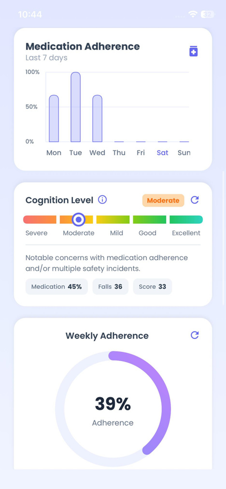
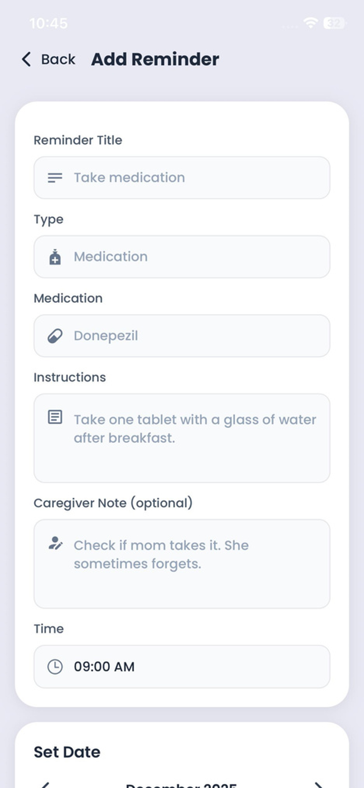
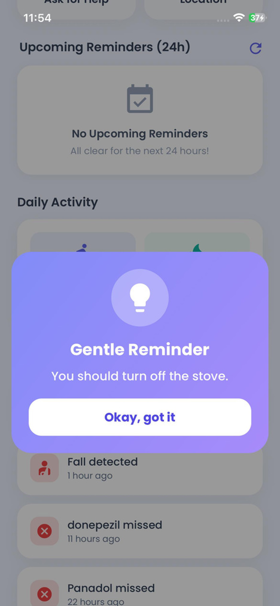
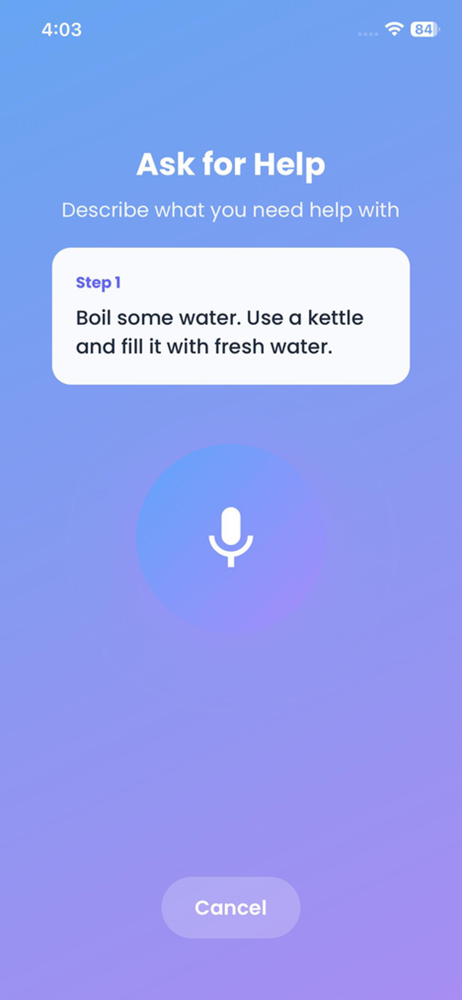
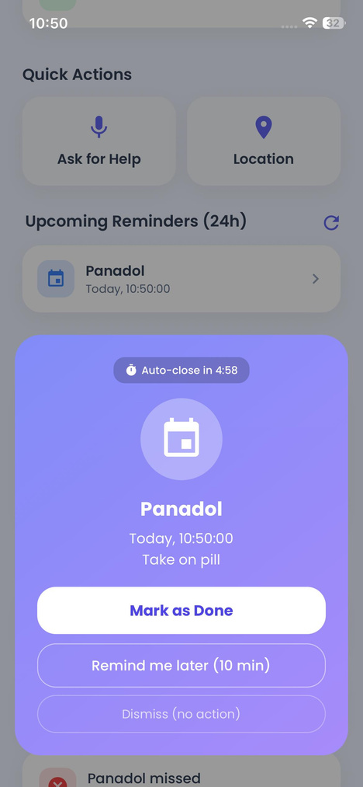

# Cognify

Cognify is a cross-platform mobile application built for a Final Year Project (FYP) focused on dementia patient support and caregiver monitoring. The app provides separate caregiver and patient experiences, combining reminders, health activity tracking, fall alerts, live location, voice assistance, face recognition, and Supabase-backed profile management.

The project is implemented with Expo, React Native, TypeScript, React Navigation, Supabase, and a configurable external AI/computer-vision backend exposed through an ngrok URL.

<p align="center">
  
  
  
  
  

</p>

## Table of Contents

- [Features](#features)
- [Tech Stack](#tech-stack)
- [Architecture](#architecture)
- [Project Structure](#project-structure)
- [Getting Started](#getting-started)
- [Configuration](#configuration)
- [Supabase Requirements](#supabase-requirements)
- [External AI Backend](#external-ai-backend)
- [Available Scripts](#available-scripts)
- [Permissions](#permissions)
- [Quality Checks](#quality-checks)
- [Troubleshooting](#troubleshooting)

## Features

### Authentication and User Roles

- Supabase email/password authentication.
- Role-based routing for caregivers and patients.
- Caregiver signup flow with profile creation.
- Patient login support through linked patient accounts.
- Password recovery through deep links using the `cognify://` scheme.
- Email and password update screens with validation.

### Caregiver Experience

- Caregiver dashboard with patient summary, online status, battery level, location access, and quick actions.
- Patient profile management, including personal details, medical information, emergency contact, notes, likes/dislikes, dementia stage, and avatar.
- Add patient workflow with account/profile creation and image upload.
- Reminder creation and editing with reminder type, medication name, instructions, caregiver note, date picker, and time picker.
- Upcoming reminder list for the next 24 hours.
- Recent patient activity feed for medication and fall events.
- Medication adherence charts and weekly adherence percentage.
- Cognition score estimation based on reminder completion and fall frequency.
- Realtime fall alert modal with location and call actions.
- Face registry management for people the patient may recognize.
- Settings for profile, patient management, notification preferences, dark mode, API backend configuration, and logout.

### Patient Experience

- Patient dashboard with caregiver call shortcut, location shortcut, device connection status, and daily activity metrics.
- Reminder popups with completion, missed, reschedule, and dismiss actions.
- Contextual reminder support using backend reminder polling and voice alerts.
- Local notes with typed input and speech-to-text transcription.
- Voice assistant for task guidance through audio prompts.
- Video upload or camera recording for task-step verification.
- Face recognition popup with relationship labels and optional speech output.
- Fall detection popup with emergency actions.
- Sign out flow with cleanup of local session metadata.

### Safety and Monitoring

- Sensor-based fall detection using accelerometer data.
- Backend video-fall polling through the external AI service.
- Supabase realtime listener for caregiver fall alerts.
- Local fall alert notifications using Expo Notifications.
- Patient location collection and caregiver map view with reverse geocoded address.
- Patient device status sync, including battery level, charging state, low power mode, and latest location.

### Health and Analytics

- Step count collection through Expo Pedometer/CoreMotion/Android sensors where available.
- Active minutes estimated from step count.
- Daily patient activity sync to Supabase.
- Weekly step history support with mock fallback when device APIs are unavailable.
- Medication adherence calculation from reminder status.
- Automatic overdue reminder marking.
- Cognition level scoring with categories: Severe, Moderate, Mild, Good, and Excellent.

### AI and Computer Vision Features

- Face registration and synchronization with the backend.
- Face recognition polling for patient-facing recognition prompts.
- Speech-to-text for patient notes.
- Voice task guidance from recorded audio.
- Video-based task verification.
- Backend fall detection polling.

## Tech Stack

| Area                 | Technology                                                               |
| -------------------- | ------------------------------------------------------------------------ |
| Mobile framework     | Expo SDK 54, React Native 0.81                                           |
| Language             | TypeScript                                                               |
| UI/runtime           | React 19, Expo modules                                                   |
| Navigation           | React Navigation native stack                                            |
| Backend-as-a-Service | Supabase Auth, Database, Storage, Realtime, Edge Functions               |
| Local storage        | AsyncStorage                                                             |
| Device APIs          | Expo Notifications, Location, Sensors, Battery, Image Picker, AV, Speech |
| Maps                 | react-native-maps                                                        |
| HTTP                 | fetch, Axios                                                             |
| Fonts                | Poppins, Space Grotesk                                                   |
| CI                   | GitHub Actions                                                           |

## Architecture

Cognify uses a client-heavy mobile architecture:

1. `index.js` registers the Expo root component.
2. `app/App.tsx` initializes API configuration, checks the Supabase session, resolves the stored role, and selects the initial route.
3. A React Navigation native stack manages all screens with hidden headers.
4. Supabase handles authentication, persistent app data, storage, and realtime events.
5. AsyncStorage caches local preferences, backend URL, session metadata, face registry data, notes, and cooldown state.
6. Service modules in `services/` isolate backend API calls, reminder logic, fall detection, health metrics, cognition scoring, patient activity, and device status.
7. An external ngrok-backed AI backend handles speech, face recognition, video processing, and related computer-vision workflows.

## Project Structure

```text
cognifyApp/
|-- app/
|   `-- App.tsx                      # App shell, navigation, deep links, startup routing
|-- contexts/
|   |-- PatientContext.tsx            # Shared caregiver-selected patient state
|   `-- ThemeContext.tsx              # Light/dark theme state
|-- screens/
|   |-- LoginScreen.tsx
|   |-- SignupScreen.tsx
|   |-- CaregiverDashboardScreen.tsx
|   |-- PatientDashboardScreen.tsx
|   |-- AddPatientScreen.tsx
|   |-- AddReminderScreen.tsx
|   |-- PatientDetailsScreen.tsx
|   |-- EditPatientDetailsScreen.tsx
|   |-- ManageFacesScreen.tsx
|   |-- PatientLocationScreen.tsx
|   |-- VoiceAssistantScreen.tsx
|   |-- SettingsScreen.tsx
|   `-- account/settings screens
|-- services/
|   |-- ApiService.ts                 # External AI/backend URL and API calls
|   |-- ReminderService.ts            # Reminder CRUD and local scheduling
|   |-- HealthDataService.ts          # Steps, activity minutes, activity sync
|   |-- FallDetectionService.ts       # Sensor and video fall detection
|   |-- FallAlertListener.ts          # Supabase realtime fall notifications
|   |-- MedicationAdherenceService.ts # Adherence metrics and maintenance
|   |-- CognitionLevelService.ts      # Cognition score calculation
|   `-- patient/caregiver helpers
|-- src/lib/
|   `-- supabase.ts                   # Supabase client
|-- supabase/
|   |-- config.toml
|   `-- functions/provision_patient/  # Edge function for patient provisioning
|-- app.json                          # Expo configuration
|-- package.json                      # Dependencies and scripts
`-- tsconfig.json                     # TypeScript configuration
```

## Getting Started

### Prerequisites

- Node.js 22 or compatible current LTS version.
- npm.
- Expo CLI through `npx expo`.
- Android Studio/emulator or Expo Go for Android testing.
- Xcode/iOS simulator for iOS testing on macOS.
- A configured Supabase project.
- A running external backend for AI/computer-vision features.

### Installation

```bash
npm install
```

For a clean CI-style install:

```bash
npm ci
```

### Run the App

```bash
npm start
```

Then choose a target from the Expo terminal UI.

Platform-specific commands are also available:

```bash
npm run android
npm run ios
npm run web
```

## Configuration

### Supabase Client

The app reads Supabase configuration from `app.json` under `expo.extra`:

```json
{
  "expo": {
    "extra": {
      "supabaseUrl": "https://your-project.supabase.co",
      "supabaseAnonKey": "your-anon-key"
    }
  }
}
```

The repository also contains `.env` keys named `EXPO_PUBLIC_SUPABASE_URL` and `EXPO_PUBLIC_SUPABASE_ANON_KEY`, but the current runtime client reads from `app.json`, not directly from `.env`.

After changing Expo config, restart with cache clearing:

```bash
npx expo start -c
```

### External Backend URL

`services/ApiService.ts` contains a default ngrok URL and also supports a saved override through AsyncStorage. The URL can be changed inside the app from:

```text
Settings -> API Configuration
```

The configured backend is required for face recognition, speech-to-text, task guidance, video processing, backend fall detection, and patient registration through the notebook/API flow.

## Supabase Requirements

### Tables Used

The app references the following Supabase tables:

- `caregivers`
- `patients`
- `patient_details`
- `profiles`
- `reminders`
- `fall_alerts`
- `patient_device_status`
- `activity_metrics`
- `med_adherence`
- `med_adherence_weekly`

### Storage Buckets

The app uploads avatars to these buckets:

- `patient_avatars`
- `caregiver_avatars`

Make sure the buckets and Row Level Security/storage policies match the app's authenticated access patterns.

### Realtime Channels

Supabase Realtime should be enabled for:

- `fall_alerts` inserts for caregiver fall alert popups.
- `reminders` changes for caregiver and patient reminder synchronization.

### Edge Function

The repository includes a Supabase Edge Function:

```text
supabase/functions/provision_patient/index.ts
```

It creates patient auth users with service-role privileges and links them to caregivers. Required environment variables include:

- `PROJECT_URL`
- `SERVICE_ROLE_KEY`
- `SUPABASE_ANON_KEY`

Never expose the service-role key in the mobile client.

## External AI Backend

The app expects the external backend to provide these endpoints:

| Endpoint                               | Purpose                                            |
| -------------------------------------- | -------------------------------------------------- |
| `GET /health`                          | Backend connectivity check                         |
| `POST /register_patient`               | Patient registration flow used by the app          |
| `POST /register_face`                  | Register a known face/person                       |
| `DELETE /delete_face/:id`              | Delete a registered face                           |
| `GET /get_face_recognitions`           | Poll recognized faces                              |
| `POST /transcribe_note`                | Speech-to-text for patient notes                   |
| `GET /get_reminders`                   | Contextual reminder polling                        |
| `POST /task_guidance`                  | Start voice-guided task assistance                 |
| `GET /task_guidance/active_session`    | Retrieve active task session                       |
| `GET /task_guidance/step_updates`      | Poll next-step/task completion updates             |
| `POST /task_guidance/cancel_session`   | Cancel active task guidance                        |
| `POST /process_video`                  | Upload video for task verification/fall processing |
| `GET /get_fall_detections?clear=false` | Poll backend-detected falls                        |
| `POST /fall_sensor_candidate`          | Submit sensor fall candidate data                  |

For local development, expose the backend through ngrok and update the URL in the app's API Configuration screen.

## Available Scripts

| Command                 | Description                         |
| ----------------------- | ----------------------------------- |
| `npm start`             | Start Expo development server       |
| `npm run android`       | Start Expo and open Android target  |
| `npm run ios`           | Start Expo and open iOS target      |
| `npm run web`           | Start Expo web target               |
| `npm run lint`          | Run Expo ESLint                     |
| `npm run reset-project` | Run the project reset helper script |

There is currently no automated test script configured.

## Permissions

The app uses several device capabilities:

- Notifications for reminders and fall alerts.
- Location for patient location sharing and fall alert coordinates.
- Motion/activity recognition for step count and fall detection.
- Battery status for caregiver visibility into patient device status.
- Photo library for avatar and face image uploads.
- Camera/video for task verification and fall/video workflows.
- Microphone/audio recording for speech-to-text notes and voice assistant prompts.
- Speech output for reminders, face recognition, and task guidance.

For standalone iOS builds, ensure `app.json` includes all required usage descriptions for camera and microphone in addition to the existing motion, location, and photo library descriptions.

## Quality Checks

Run linting locally with:

```bash
npm run lint
```

The GitHub Actions workflow runs on pushes and pull requests to `main`:

1. Check out the repository.
2. Set up Node.js 22.
3. Install dependencies with `npm ci`.
4. Run `npm run lint`.
5. Run `npx expo prebuild --non-interactive` to validate native project generation.

## Troubleshooting

### Supabase URL or key missing

If the app throws a Supabase configuration error on startup, confirm `app.json -> expo.extra.supabaseUrl` and `app.json -> expo.extra.supabaseAnonKey` are present, then restart Expo with:

```bash
npx expo start -c
```

### AI features do not work

Open `Settings -> API Configuration`, verify the ngrok URL, and test the backend connection. The backend must be reachable from the phone/emulator and must implement the expected endpoints.

### Face registration saves locally but does not sync

Check that the backend `/health` endpoint is reachable and that `/register_face` accepts the expected payload from the app.

### Reminders or fall alerts do not update live

Verify Supabase Realtime is enabled for the relevant tables and that Row Level Security policies allow the authenticated user to read the required rows.

### Location or activity metrics are unavailable

Confirm runtime permissions are granted on the device. Some simulator/emulator environments do not provide real pedometer, battery, or location data.

## Notes

- This is an academic FYP mobile application and should be reviewed carefully before production or clinical use.
- The cognition level shown in the caregiver dashboard is an app-level support metric, not a medical diagnosis.
- Local notifications are used for reminders and fall alerts; the app does not currently register remote push tokens.
- Do not commit production secrets or service-role credentials to the mobile app repository.
